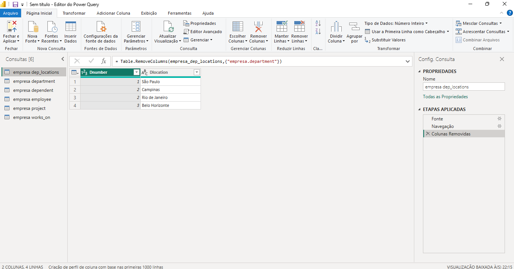
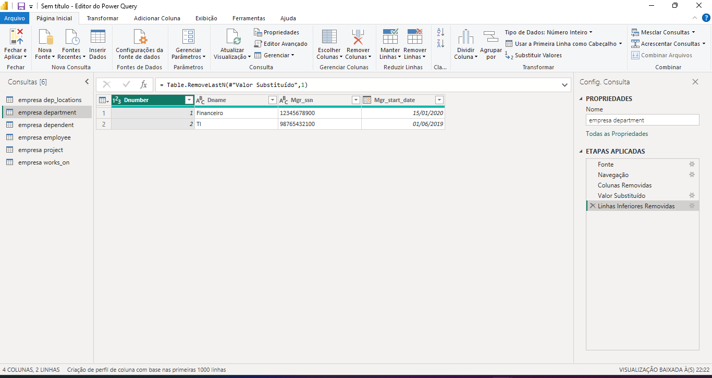
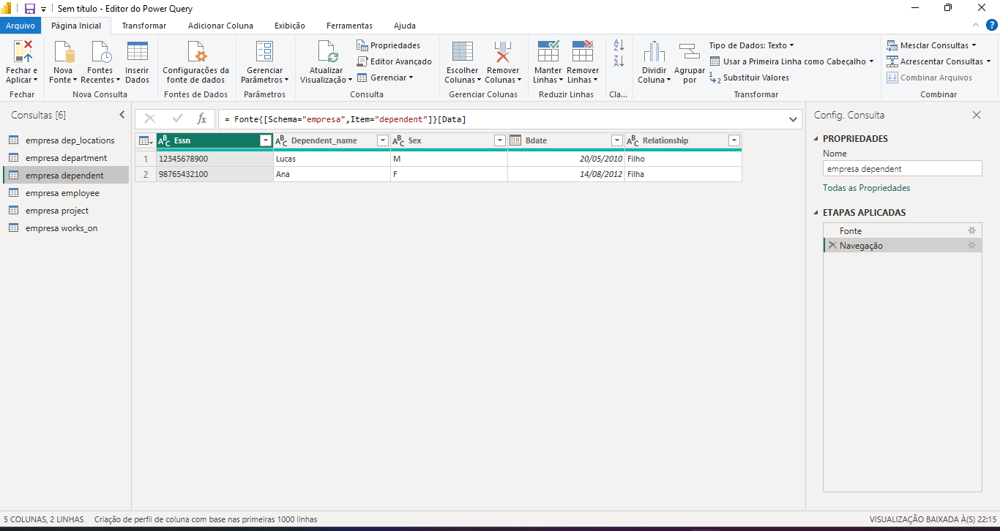
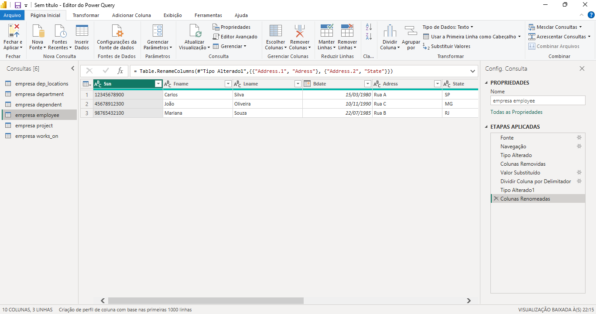
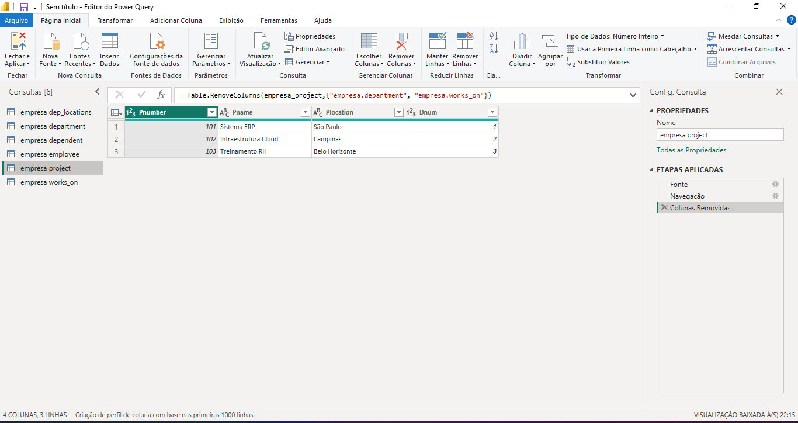
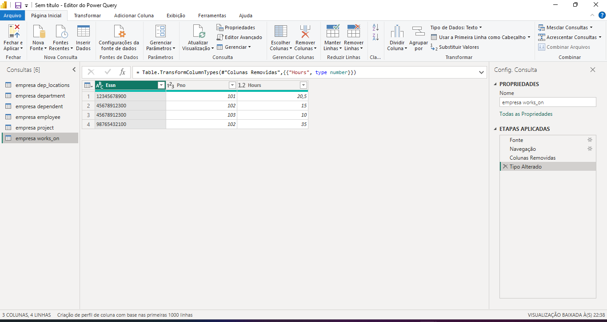

# 📊 Projeto Power BI - Empresa

Este projeto foi desenvolvido como parte do desafio da DIO, com o objetivo de conectar um banco de dados relacional MySQL ao Power BI, realizar transformações nos dados e preparar as tabelas para futuras análises visuais e construção de um modelo estrela.

---

## 🧱 Estrutura do Banco de Dados

- Banco: `empresa`
- Tabelas utilizadas:
  - `Employee`
  - `Department`
  - `Project`
  - `Works_on`
  - `Dependent`
  - `Dep_Locations`

---

## 🔗 Etapas Realizadas

### 1. Conexão com o MySQL
- Conexão feita via Power BI Desktop usando o conector nativo para MySQL
- Autenticação com usuário e senha do MySQL
- Importação das tabelas diretamente do banco `empresa`

### 2. Transformações no Power BI
- Verificação e ajuste dos tipos de dados (datas, textos, números decimais)
- Substituição de valores nulos por zero em colunas numéricas
- Eliminação de colunas desnecessárias para simplificar o modelo

### 3. Prints das Tabelas Transformadas
Abaixo estão os prints das tabelas após as transformações realizadas no Power Query Editor:

---

## 📌 Próximos Passos (em andamento)
- Criar relacionamentos entre as tabelas no modelo de dados
- Mesclar dados de colaboradores com seus respectivos departamentos e gerentes
- Criar colunas derivadas (ex: nome completo, departamento + localização)
- Construir visuais e métricas no Power BI
- Documentar todas as transformações e decisões no README final

---

## 🧠 Aprendizados
> Este projeto está sendo desenvolvido como parte do meu processo de aprendizado em modelagem de dados e visualização com Power BI. Ainda tenho muito a aprender, mas estou evoluindo com cada etapa.

---

## 📁 Arquivos Utilizados
- Script SQL de criação e inserção de dados (salvo localmente)
- Power BI Desktop (.pbix) com as transformações aplicadas
- Prints das tabelas transformadas no Power Query Editor

---

Se você estiver lendo este README como parte da avaliação, obrigado pela oportunidade! 😄

